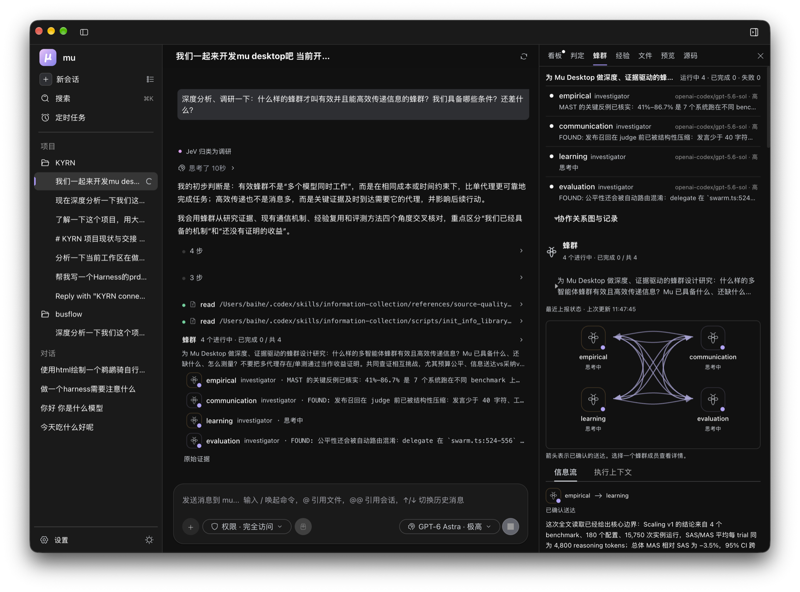
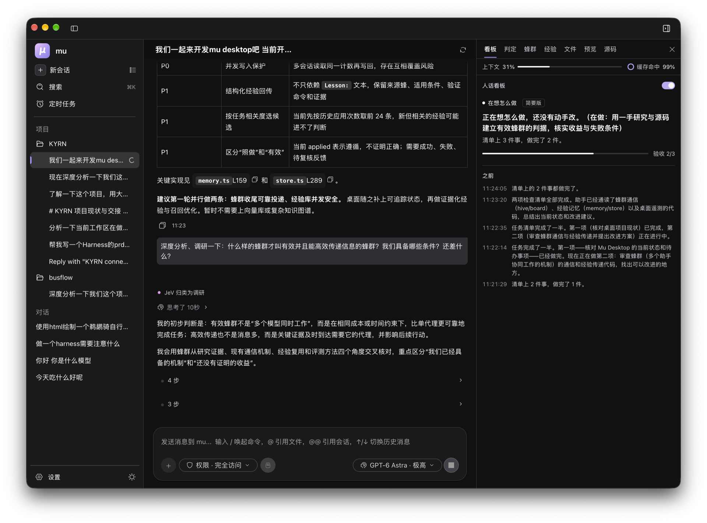

<p align="center">
  
</p>
<p align="center">μ · Only what's needed.</p>

<p align="center">
  <a href="../../README.md">English</a> · <b>简体中文</b> · <a href="README.zh-TW.md">繁體中文</a> · <a href="README.ja.md">日本語</a> · <a href="README.ko.md">한국어</a>
</p>

# mu

mu 是一个带判定内核的编码代理：pi 的一个深度分支，加上一层叫 Jev 的判定，和一个桌面端。

- **mu**：编码代理的命令行，pi 的全部能力，加上 Jev 的判定层
- **mu 桌面端**：原生桌面应用，自带 mu，下载即用
- **Jev**：一个百毫秒级的小判定模型。大模型负责做事，Jev 在每个决策点回答一个问题：现在需要什么

> 还在早期开发阶段。作者每天在用，但没有正式发布过；名字、设置和文件格式都可能变。

## 安装

**桌面端。** 安装包由 GitHub Actions 构建，发布在 [Releases](https://github.com/qybaihe/mu/releases)：macOS（Apple 芯片 / Intel）、Windows（x64 / Arm）、Linux（x64 / Arm）。应用自带运行时和 mu 本体，不需要装 Node，不需要额外配置。打开后接一个模型（API 密钥或订阅登录）和 Jev 的密钥就能开始。

<!-- 签名之前保留这一行；拿到证书并公证后删掉 -->
macOS 若提示无法验证开发者：在 Finder 里右键点击应用，选「打开」，只需一次。

**命令行。**

```bash
npm i -g mu-agent
mu
```

需要 Node 22.19 或更新。桌面端和命令行共用 `~/.mu` 里的账号、设置和经验。

## Jev 在哪里

你感觉不到 Jev。它不替模型多问你一句，也不在界面上多一个按钮；它只改变模型接下来做什么。每一轮里，它在这些地方：

- **你说话时。** 这句话是新任务、追问还是纠正，先判断再开工；正在做事时你插一句，要不要打断。
- **动手之前。** 这条命令会不会造成不可逆的后果；按你定下的规矩能不能放行；权限选「Jev 审批」时，该问你的问你，不该问的直接过。
- **工具返回时。** 输出里哪些该进上下文，哪些是重复和噪音；测试日志里失败的部分留下，一遍遍重复的去掉；过期的结果放下。
- **上下文变长时。** 什么可以放下而不用写摘要；缓存快过期时值不值得续一次。这是缓存命中率高、上下文一直不满的原因。
- **一轮结束时。** 做完了没有，由大模型核对、Jev 兜底；有没有偏离任务；要不要退回某个检查点。
- **学习时。** 你的纠正、代理自己绕过的坑、子代理带回的教训：值不值得记、和已有的经验是同一条还是矛盾、这次有没有照做。没人照做的经验自动退役。
- **多代理时。** 交给哪种角色；子代理交回的补丁有没有越界；蜂群里哪条发现值得传给别的 bee。

三十多个决策点，每一个都能在设置里单独选：Jev、本地判定（Laya，模型在本机跑，不走网络）、或关掉。每一次判定都留在判定流水里，桌面端的右侧面板能看到。

## 蜂群

多代理系统都要回答同一个问题：一个代理知道的，要不要告诉另一个？常见的答案有四种：什么都不传，只向主代理汇报；什么都传，群聊或交接时带上全部历史；每个代理自己的大模型来决定；或者靠固定规则和环境（订阅、git）。mu 的答案是第五种：让 Jev 当闸门。

一个蜂群是 2 到 6 只 bee，各有自己的关注点，只读代码、跑命令、开浏览器；bee 不改代码，改动由主模型来做。每只 bee 每说完一段，Jev 判一次：这段话里有没有值得共享的东西，是发现、死路、决定还是阻塞。值得的上共享板。板上每来一条新的，Jev 再对每一只别的 bee 判一次：这条和它的关注点有没有关系。有关系的送过去，标明「这是发现，不是指令」。

板只增不删，所以后来的结论会推翻早先的：一只 bee 先说测试跑不起来，后来清掉环境变量跑通了。Jev 判两条笔记的关系（推翻、矛盾、支持），推翻的结论变成一条「纠正」送给所有拿着旧结论的 bee；互相矛盾的两条都留着、标成「争议」，超过一分钟没解决就派一只核实 bee 去查。

<p align="center"></p>

桌面端右侧的「蜂群」页就是这一切的现场。每只 bee 一行：角色、模型、此刻在做什么或刚说了什么。连接图画出谁把发现送给了谁，线越粗送达越多，纠正和争议各有自己的画法；一条发现送到的那一刻，会沿着线亮一下。信息流里是每一条送达的原文，判定记录里是 Jev 的每一次裁决。对话里的蜂群卡片带一张缩略图，点开就跳到这一页。

一次真实的运行：3 只 bee，9 分钟，Jev 评了 117 条候选，27 条上了板，16 条被投递到需要它的 bee 那里。每一次判定都写在运行目录的日志里，可以复盘。

`/swarm` 实时看每一只在做什么，`/swarm stop` 让它现在交报告，`/swarm kill` 立刻结束。到时间的 bee 会被要求交报告，不交的会被结束；卡住的模型或工具由看门狗处理，蜂群永远会返回。

## 人话看板

不看代码的人也能知道代理做到哪了。打开看板（`/board`，或桌面端看板页顶部的开关），代理每做一段，看板就用大白话说三件事：现在在做什么，清单上几件事做完了几件，有哪些要你确认；下面按时间留着之前的每一段。一次运行结束时，看板做一次总结。

<p align="center"></p>

这些字不是模型原话的缩写。Jev 从判定和事件里挑出真正算新消息的那几条，再由一个说话清楚的模型讲出来；看板跟着权限、目标和子代理走，代理换了做法，看板也换一种说法。顶上两个数是上下文占了多少、缓存命中率多少：它们是 Jev 在上下文和缓存上做的那些判定的结果，也是你判断这一轮还能走多远的依据。

## 还有这些

- **权限三档。** 全部放行、Jev 审批、最小权限，随时在发送框切换。
- **目标。** `/goal <条件>`，代理一直干到条件成立；`/goal clear` 结束。
- **经验库。** 经验只追加，可编辑，可退役；命令行和桌面端共用。
- **订阅登录。** ChatGPT、Claude、Grok，以及 Gemini CLI / Antigravity 的 Google 登录，在应用内完成。
- **带过来的对话。** Claude Code 和 Codex CLI 的对话可以导入，接着聊。
- **内置浏览器、后台命令、MCP。** 代理在浏览器里逐步操作；开发服务器和长构建放到后台跑；MCP 服务器按需启动。

## 命令

在发送框输入 `/` 唤起；桌面端也能在命令面板（⌘K）里搜。

| 命令 | 做什么 |
| --- | --- |
| `/goal <条件>` | 一直干到条件成立 |
| `/permissions` | 全部放行 / Jev 审批 / 最小权限 |
| `/board` | 打开或关闭人话看板 |
| `/remember`、`/lessons`、`/forget` | 记一条经验、看经验库、让一条退役 |
| `/review`、`/commit` | 评审改动并按严重程度分级；写提交 |
| `/checkpoints`、`/rewind` | 看检查点；退回到某一个 |
| `/agents`、`/swarm` | 派子代理；看正在干活的每一只 |
| `/browse`、`/jobs` | 内置浏览器；后台命令 |
| `/import-chat` | 导入 Claude Code 或 Codex 的对话 |
| `/doctor` | 检查配置和连接 |

## 隐私

密钥只保存在本机 `~/.mu`。mu 不会替你下载任何模型或运行时：需要下载的东西都会先问你。Jev 只看到判定所需的片段。

## 开发

```bash
npm install --ignore-scripts   # 安装依赖，不跑生命周期脚本
npm run check                  # 格式、静态检查、类型
./test.sh                      # 测试（没有密钥时跳过依赖模型的测试）
```

桌面端在 `desktop/`：`bun install`，然后 `KYRN_ROOT="$(cd .. && pwd)" bun run start` 起开发版，它从仓库里的 mu 启动（先在根目录 `npm install`）。仓库布局、贡献规则见 [AGENTS.md](../../AGENTS.md)。

## 来源与协议

mu 基于 [pi](https://github.com/earendil-works/pi)（编码代理，MIT；根目录的 [LICENSE](../../LICENSE) 覆盖 `packages/` 和 `kyrn/`）和 [AionUi](https://github.com/iOfficeAI/AionUi)（桌面端，Apache 2.0；`desktop/` 保留它的 [LICENSE](../../desktop/LICENSE)）改造，感谢两个项目。判定层用到的第三方代码列在 [THIRD_PARTY_NOTICES.md](../../packages/kyrn-judge/THIRD_PARTY_NOTICES.md)。
